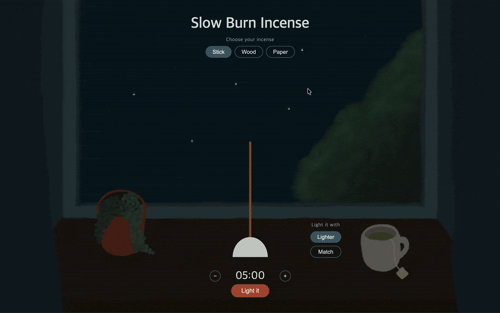

# Slow Burn Incense

A small web app for burning incense as a quiet, stress-relieving break.
Pick an incense, light it, and watch it burn down slowly beside an open window at night.

**Live demo:** https://eue6ne.github.io/slow-burn-incense/

## Features
- Three incense types: stick, wood, and paper, each with its own holder and shape
- Two ways to light it: lighter or match (sparks, a flickering flame, and a match-strike animation)
- Adjustable timer (1 to 60 minutes) with the incense burning down from the tip
- Glowing ember, scorch mark, drifting smoke, and a final wisp of smoke when the timer ends

## How to use
1. Choose an incense and a way to light it.
2. Set the timer with the - and + buttons.
3. Press **Light it** and let it burn.

## Tech
HTML, CSS, and vanilla JavaScript (no frameworks or libraries).

## Implementation notes
- All elements are positioned inside a box that keeps the same aspect ratio as the background illustration, so everything stays aligned at any screen size.
- The app state (idle, igniting, burning, done) lives in a single place, and CSS shows or hides the buttons and menus based on it.
- The burn-down effect uses `clip-path` to cut the incense from the top, so it works the same way for plain shapes and for real images.

## Known limitations
- Designed for desktop screens; portrait mobile layouts are not optimized.
- The incense, lighter, and match are drawn with CSS shapes as simple mockups.

## Credits
The background illustration was drawn by me.